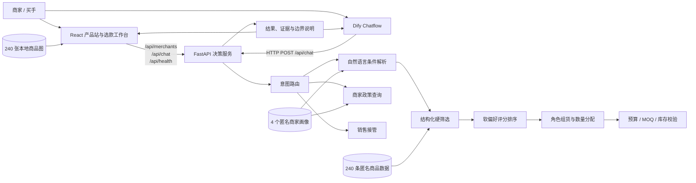
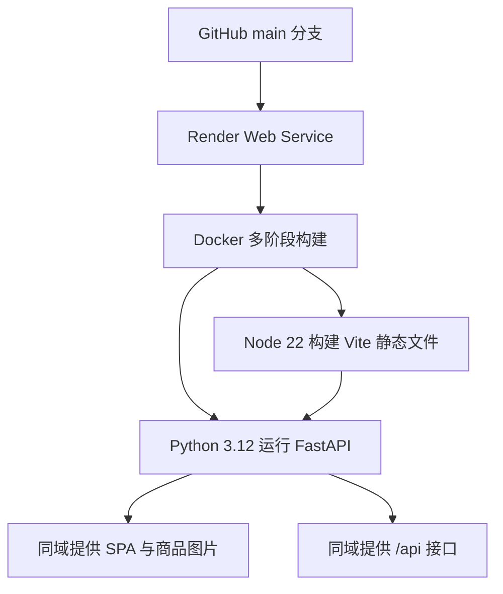

# StyleMate Supply 项目介绍

## 一句话介绍

StyleMate Supply 是一个面向服装供应商客户的智能选款台。淘宝、抖音电商、小红书店铺等商家可以用自然语言描述渠道、客群、品类、价格带、MOQ 和采购预算，系统从匿名货盘中执行硬筛选，完成结构化组货、建议件数和采购测算，并把需要实时权限或商务判断的请求交给销售人员。

- 在线产品站：`stylemate-ai.onrender.com`
- Dify 对话版：`udify.app/chat/F7zH8BBzefvLGEna`
- GitHub：`github.com/huihui1071/StyleMate-AI`

## 1. 产品背景

### 1.1 业务场景

服装供应商通常拥有数量较大的货盘，而中小网店商家在上新前需要从中完成选品和首批采购。传统流程经常依赖商品表格、图片文件、销售经验和多轮即时通信，商家要反复说明自己的渠道、目标客群、价格带和预算，销售再人工筛选并整理清单。

这类任务不是单纯的“找相似商品”，而是一个带有经营约束的采购决策：

- 商品必须适合店铺渠道与目标人群。
- 零售价、起订量和首批成本不能越界。
- 一批货要同时包含主销、引流、形象、连带和测试角色。
- 建议数量要符合 MOQ、库存和预算。
- 最终价格、锁货、账期和合同需要真实业务人员确认。

### 1.2 目标用户

主要用户：

- 淘宝、抖音电商和小红书店铺商家。
- 买手、采购人员和小型零售团队。
- 需要快速完成新一季首批选款的经营者。

协作用户：

- 供应商销售、招商主管和跟单人员。
- 负责价格确认、库存锁定、账期、合同和物流的业务人员。

### 1.3 要解决的问题

| 问题 | 传统方式的不足 | 项目方案 |
|---|---|---|
| 需求表达不结构化 | 销售需要从聊天记录中反复确认 | 将自然语言转换为统一的采购条件 |
| 货盘检索效率低 | 在大量表格和图片中人工筛选 | 对渠道、人群、品类、价格、MOQ 等字段执行硬筛选 |
| 单品推荐不等于组货 | 高分商品简单拼接可能导致结构失衡 | 为商品分配五种经营角色并控制比例 |
| 采购风险不透明 | 数量、成本和毛利需要人工计算 | 自动计算款数、件数、采购额、零售额和毛利空间 |
| AI 容易越权 | 可能虚构库存、价格或下单结果 | 把交易类请求转为带上下文的销售接管摘要 |
| Demo 难以验证 | 只有对话文案，看不到决策过程 | 展示识别条件、推荐理由、供货字段和测试结果 |

## 2. 产品定位

项目不是消费者穿搭助手，也不是开放式聊天机器人，而是供应商侧的采购决策辅助工具。

核心流程：

```text
商家画像 → 自然语言选款目标 → 硬条件筛选 → 软偏好排序
        → 五类角色组货 → 采购清单 → 销售接管
```

### 2.1 核心功能

#### 商家画像

系统内置 4 个匿名演示商家，画像包括经营渠道、经营阶段、目标客群、价格带、风格偏好、默认预算、折扣系数和样衣额度。切换商家会清空已有结果与采购清单，避免上下文串用。

#### 智能选款

系统能够识别并筛选：

- 人群、渠道、品类和匿名系列。
- 颜色、版型、材质、季节和风格。
- 零售价区间、采购预算、目标款数和 MOQ 上限。

硬条件没有完全命中时返回空结果，不会为了“给出答案”自动放宽条件。

#### 结构化组货

默认 12 款组货目标为：

| 经营角色 | 默认款数 | 基础目标件数 | 主要作用 |
|---|---:|---:|---|
| 主销款 | 4 | 8 | 承担主要销量，偏向稳定库存和毛利 |
| 引流款 | 2 | 10 | 覆盖价格带下沿，降低购买门槛 |
| 形象款 | 2 | 3 | 强化店铺风格与视觉表达 |
| 连带款 | 2 | 6 | 补足容易组合销售的品类 |
| 测试款 | 2 | 2 | 用较低数量验证新风格和风险 |

系统优先避免重复 `style_code`，数量向上取整到 MOQ 的整数倍，并且不能超过演示库存。

#### 采购清单

推荐结果自动进入采购侧栏，商家可以按 MOQ 增减数量或移除款式。界面实时计算：

- 款数与总件数。
- 采购金额与预算余量。
- 预计零售额。
- 预计毛利空间。

#### 商家政策

商家可以查询对应的等级、结算折扣系数、样衣额度和专属销售等演示信息。

#### 销售接管

当需求涉及议价、锁货、实时库存、账期、合同、发票、物流、售后或大额采购时，系统停止自动决策，生成包含商家和当前需求的接管摘要。Demo 不会发送真实消息、锁定库存或创建订单。

## 3. 设计原则

1. **经营目标先于商品浏览**：先理解店铺与采购任务，再展示货盘。
2. **硬筛选先于评分排序**：必须满足的条件不能被模型或评分悄悄放宽。
3. **组货结构先于单品高分**：一批可卖的货需要角色组合，而不只是若干高分 SKU。
4. **数字始终可解释**：推荐理由、MOQ、库存、采购额和毛利均可查看。
5. **人工接管是正常闭环**：涉及真实权限时转交业务人员，不把“转人工”当作失败。
6. **演示数据边界明确**：真实商品素材与模拟经营字段分开说明。

## 4. 系统架构

### 4.1 总体架构



### 4.2 前端层

技术栈：React、TypeScript、Vite、原生 CSS。

产品包含两个主要页面：

- `/`：产品介绍页，通过真实商品图片和在线预览解释产品价值。
- `/demo`：完整选款工作台。

工作台采用三栏结构：

- 左栏：商家画像与画像切换。
- 中栏：任务输入、识别条件、选款或组货结果。
- 右栏：采购清单、数量调整、金额汇总和销售接管入口。

关键交互状态由 React 管理，包括当前商家、查询、结果、选款清单、加载状态和服务状态。切换商家时主动清空结果，采购数量被限制在 MOQ 与库存之间。

### 4.3 API 与决策服务

FastAPI 提供三个核心接口：

| 方法 | 路径 | 作用 |
|---|---|---|
| GET | `/api/health` | 健康检查和演示数据规模 |
| GET | `/api/merchants` | 获取匿名商家画像 |
| POST | `/api/chat` | 处理选款、组货、政策查询和销售接管 |

`POST /api/chat` 请求示例：

```json
{
  "message": "淘宝女装，零售价300-700元，选12款春季新品，首批预算3万",
  "merchant_id": "MERCHANT-DEMO-01",
  "mode": "assortment"
}
```

`mode` 支持 `auto`、`selection`、`assortment` 和 `account`。在 `auto` 模式下，系统优先识别需要销售接管的高风险请求，再判断政策查询和组货意图，最后进入普通选款。

### 4.4 自然语言解析

当前版本使用可审计的规则词典和正则表达式，而不是让大模型直接生成筛选条件。`parse_query` 将文本转换为 `ParsedQuery`：

```text
department / category / audience / color / fit / material
season / styles / retail_min / retail_max / budget
platform / target_count / line / moq_max
```

同义词会被归一化，例如“上班、办公室、职场”统一映射为“通勤”，“抖店、直播”统一映射为“抖音电商”。价格区间、预算、款数和 MOQ 使用正则提取。

选择这个方案的原因是 Demo 阶段更重视稳定性、可解释性和可测试性。它的代价是语言覆盖有限，生产版需要引入结构化输出模型或更完整的 NLU 服务，同时保留后端校验。

### 4.5 硬筛选与软排序

硬筛选只判断商品是否有资格进入候选集，使用全部条件同时满足的逻辑：

- 显式输入条件优先。
- 未显式输入时，可以继承商家画像中的人群、渠道和价格带。
- 商品库存必须不低于 MOQ。
- 任一硬条件失败，该商品就不会进入候选。

进入候选集后再进行软评分，主要特征包括：

- 用户输入风格与商品风格的匹配。
- 商家历史偏好与商品风格的匹配。
- 商家偏好品类。
- 毛利空间、库存水平和风险等级。
- 交期和 MOQ。

每个结果附带最多 3 条推荐理由，评分不会覆盖硬筛选结果。

### 4.6 组货与预算算法

组货过程分为四步：

1. 把目标款数展开为经营角色序列。
2. 针对每个角色使用不同的 `role_fit` 规则选出最合适商品。
3. 根据角色目标件数计算数量，并向上取整到 MOQ 的整数倍。
4. 如果采购额超出预算，先按 MOQ 逐步减少可缩减商品的数量；仍超预算时，优先移除测试款或形象款中的高成本商品。

商家折扣会作用到供货单价：

```text
结算单价 = round(供货价 × 商家折扣系数)
行金额 = 结算单价 × 建议件数
预计毛利率 = (预计零售额 - 采购额) / 预计零售额
```

### 4.7 Dify 编排版

Dify 版本复用同一个确定性 API，不让 LLM 重新生成商品或修改业务规则。Chatflow 包含：

```text
商家画像输入
  → HTTP 请求调用 /api/chat
  → Python Code 节点整理可解释 Markdown
  → Answer 节点输出
```

Dify 的作用是提供对话入口和流程编排；商品筛选、排序、预算和接管判断仍由 FastAPI 决策服务完成。这样独立 Web 版和 Dify 版不会产生两套不同的业务答案。

## 5. 数据设计与隐私处理

### 5.1 当前演示数据

- 240 条匿名 SKU。
- 4 个匿名系列，每个系列 60 条。
- 120 条女装、60 条男装、60 条童装。
- 22 个品类，覆盖上装、外套、裤装、裙装和套装。
- 当前季节数据为春、夏两季。
- MOQ 范围为 2–6 件。
- 240 张已经本地化的商品图片。

### 5.2 字段边界

商品品类、颜色、版型、材质、描述和商品图片来自经过匿名化处理的项目资料。供货价、建议零售价、库存、MOQ、交期、渠道、折扣、信用额度和经营测算为 Demo 模拟字段，不代表真实商务信息。

仓库不保留：

- 真实企业名和真实品牌名。
- 原始款号、源 SKC 或可反查的源标识。
- 原始图片链接和源文件元数据。
- 真实客户、订单、价格或库存数据。

项目提供隐私扫描脚本，在提交和部署前检查禁用词、源款号形态、外部链接和不应进入仓库的文件。

## 6. 部署架构

项目使用单服务 Docker 部署：



第一阶段使用 Node 构建 React；第二阶段只保留 Python 运行时、FastAPI、匿名数据和前端构建产物。FastAPI 同域提供 API、SPA 和图片资源，避免线上前端依赖本地地址和额外 CORS 配置。

Render 通过 `/api/health` 进行健康检查。免费实例可能休眠，因此首次访问可能需要等待服务唤醒。

## 7. 可解释性与安全边界

项目把“解释”放在决策链路中，而不是在结果后让模型补写一段话：

- 解析结果展示为条件证据。
- 硬筛选条件可以逐项检查。
- 评分理由来自实际命中的特征。
- 每个组货商品拥有明确经营角色。
- 数量、单价、折扣、预算和毛利均可复算。
- 无结果时明确说明不会放宽条件。
- 交易类请求明确显示“未执行”，并生成接管原因和负责人。

## 8. 测试与质量保障

`npm run check` 依次执行：

1. 隐私扫描。
2. Python 后端规则测试。
3. 前端工具函数测试。
4. TypeScript 与 Vite 生产构建。

后端共有 12 个测试场景，覆盖：

- 200+ SKU 与本地图片完整性。
- B2B 必需字段和数值关系。
- 年龄与价格区间不混淆。
- 复合硬条件筛选。
- 无结果时不自动放宽条件。
- 五类角色和预算控制。
- MOQ、库存与行金额计算。
- 不同商家画像产生不同候选。
- 商家政策查询。
- Dify 通过展示名选择商家。
- 交易请求进入销售接管。
- 4 个匿名商家画像。

前端测试覆盖货币格式、百分比格式和意图标签。生产构建同时执行 TypeScript 类型检查。

## 9. 项目亮点

### 产品层

- 从消费者推荐转向供应商选款，明确了付费方、使用者和业务闭环。
- 把推荐结果升级为可调整的采购清单，而不是停留在商品卡片。
- 把销售接管设计成流程的一部分，覆盖 AI 无权限完成的最后一公里。

### 技术层

- 把自然语言理解、硬筛选、软排序、组货和预算控制拆成可测试模块。
- Web 与 Dify 复用同一决策 API，避免渠道之间答案漂移。
- 使用确定性规则处理关键业务约束，降低大模型幻觉风险。
- 使用同域单服务部署，降低个人项目的部署复杂度。

### 数据与可信度

- 使用 240 条商品和真实商品图片，而不是少量手写样例。
- 明确区分匿名化真实属性与模拟经营字段。
- 提供隐私扫描、边界说明和可复算指标。

## 10. 当前局限

1. 自然语言理解主要依赖正则和同义词词典，对复杂表达、否定、比较和多轮指代支持有限。
2. 数据只覆盖春、夏两季，不能完整验证秋冬组货。
3. 排序权重和角色比例来自产品假设，尚未用真实成交、退货和售罄数据训练或校准。
4. 当前数据使用 JSON 文件，缺少数据库、索引、后台配置和版本管理。
5. 库存、价格、折扣、信用额度和交期均为模拟值，没有连接 ERP、WMS 或 OMS。
6. 前端采购清单保存在页面状态中，刷新后不会恢复，也没有账号和权限系统。
7. 销售接管只生成摘要，没有真正创建 CRM 线索、企业消息或工单。
8. Dify 工作流配置在云端，当前仓库没有保存可导入的 DSL 版本。
9. 当前测试以规则回归为主，尚缺少独立标注集、离线排序指标、用户任务完成率和线上 A/B 实验。
10. 默认角色分布最适合 12 款任务；目标款数较少时，需要更合理的动态角色配比策略。

## 11. 生产化演进路线

### 第一阶段：数据与权限接入

- 使用 PostgreSQL 保存商品、商家、采购清单和规则版本。
- 接入 ERP/WMS 的实时库存、价格和交期。
- 增加登录、租户隔离、角色权限和审计日志。
- 将销售接管接入 CRM 或企业通信工具。

### 第二阶段：增强自然语言理解

- 使用支持 JSON Schema 的模型生成结构化查询。
- 对模型输出执行 Pydantic 校验和字段白名单检查。
- 保留确定性硬筛选与预算引擎，不让模型直接决定交易结果。
- 增加多轮上下文、澄清问题和冲突条件提示。

### 第三阶段：数据驱动排序

- 引入浏览、加购、采购、售罄、退货和复购数据。
- 建立学习排序或分层推荐模型。
- 针对不同渠道、地区和店铺阶段学习角色比例和数量策略。
- 使用覆盖率、约束满足率、采购采纳率、售罄率和毛利等指标评估。

### 第四阶段：供应链闭环

- 支持样衣申请、报价确认、库存预占和订单草稿。
- 对高风险动作增加人工审批和幂等控制。
- 建立从推荐理由到最终采购与销售结果的可追溯链路。

## 12. 目录结构

```text
StyleMate-AI/
├── apps/
│   ├── api/
│   │   ├── main.py          # FastAPI 接口与 SPA 托管
│   │   └── engine.py        # 解析、筛选、排序、组货与接管逻辑
│   └── web/
│       ├── src/
│       │   ├── LandingPage.tsx
│       │   ├── Advisor.tsx
│       │   ├── types.ts
│       │   └── styles.css
│       └── public/images/   # 本地匿名商品图
├── data/demo/
│   ├── products.json
│   └── merchants.json
├── tests/test_engine.py
├── scripts/privacy_scan.py
├── Dockerfile
├── render.yaml
├── PRODUCT.md
└── DESIGN.md
```
